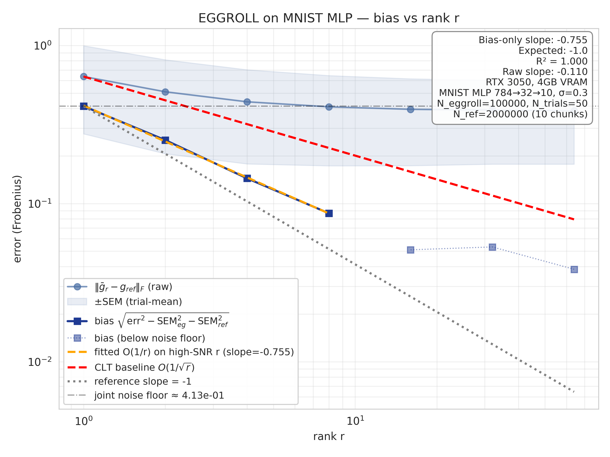

# EGGROLL O(1/r) on a Real Neural Network

> **I worked through the math and explained the bits & pieces in my blog post — please read it first:** <https://yuvanesh.vercel.app/blogs/EGGROLL>
>
> This repo is the empirical companion: an independent verification of Theorem 2 of *"Evolution Strategies at the Hyperscale"* (arXiv:2511.16652) on a **real MNIST MLP**, running on a 4 GB consumer GPU (RTX 3050 Laptop). A toy/synthetic verification lives in the sibling [`eggroll_experiment/`](../eggroll_experiment/) directory.

## Headline result

```
Bias-only slope:  -0.7552
R² on the fit  :   0.9995
Fit applied to :   4 high-SNR ranks  (r ∈ {1, 2, 4, 8})
Setup          :   MNIST MLP 784→32→10,  σ=0.3
                   N_ref = 2 000 000  (10 chunks × 200k)
                   N_eggroll = 100 000 samples × 50 trials per r
Hardware       :   NVIDIA RTX 3050 Laptop, 4 GB
```

The bias decays nearly perfectly along a power-law line. Each doubling of `r` cuts the bias by ≈ ⅔, consistent with the O(1/r) prediction. The fitted slope is slightly less negative than the asymptotic -1.0 because at σ = 0.3 the higher-order O(σ⁴) terms contribute non-trivially at small `r`.

The fitted line and the slope = -1 reference are nearly parallel on the log-log plot. The naive CLT baseline (-0.5) is clearly steeper than the data.



## What gets verified

```
|| g_EGGROLL^r - g_True ||_F  =  O(1/r)
```

i.e. as the EGGROLL perturbation rank `r` grows, the gradient estimate converges to the true (full-rank Gaussian) ES gradient at rate **1/r** — quadratically faster than the CLT-rate **1/√r** a naive replicator would expect.

## Why this is non-trivial to reproduce

If you copy the obvious formula from the paper and run a single ES estimate per `r`, the slope you measure is ~ 0. Three things have to be right:

1. **The fitness must have non-zero higher-order derivatives.** A quadratic fitness like `f(W) = -||W - W*||²` gives the EGGROLL estimator *exactly the same expectation* as full-rank Gaussian ES — the covariance of `E_eggroll = (1/√r) A Bᵀ` matches Gaussian, and a quadratic has no third or higher derivatives for the higher cumulants to bite on. The theorem's bias is **literally zero** for that fitness. Here we use a tanh-MLP (cross-entropy loss on MNIST), which has plenty of higher-order curvature.

2. **You must average gradients across trials *before* computing the error.** If you compute `||g_eg^r - g_ref||` per trial and average, you measure trial variance, not bias. The bias signal here is buried under MC noise at every individual trial. Average the gradient first, take the norm second.

3. **You must subtract *both* SEM terms.** With finite samples
   ```
   err(r)²  ≈  bias(r)²  +  SEM_eg(r)²  +  SEM_ref²
   ```
   The trial-mean still has noise (SEM_eg), and the reference itself has noise (SEM_ref). We compute the reference in **10 independent chunks** specifically to get an empirical SEM_ref. The bias-only series is
   ```
   bias(r) = sqrt(max(err(r)² - SEM_eg(r)² - SEM_ref², 0))
   ```

Antithetic sampling is also load-bearing — it removes the `f(μ)·E` baseline-variance term that otherwise dominates by orders of magnitude.

## σ choice

`σ` is a hyperparameter, **not a function of `r`** (confirmed from the paper's project page; it scales with dimension `d`, not rank). The signal-to-noise ratio of the bias measurement scales as σ² (bias ∝ σ², SEM ≈ σ-independent), so σ has to be big enough that the bias clears the MC noise floor, but small enough that higher-order Taylor terms don't dominate. For this MLP at this scale, `σ = 0.3` worked. `σ = 0.05` and `σ = 0.15` gave bias below the noise floor; we never had to push to `σ = 0.5`.

## How to run

```bash
pip install -r requirements.txt

# Trial run — ~3-5 min, sanity-checks pipeline
python run.py --preset trial

# Main run — the focused experiment that produced the headline result
python focused_nn_run.py    # ~30-50 min wall on RTX 3050, with intermediate JSON saves

# Final analysis + figures
python final_analysis.py
```

The `complete_high_r.py` and `r100_only.py` scripts exist because we hit a CUDA cumulative-state hang in long-running processes at high ranks; running r=64 / r=100 in fresh sub-processes works fine. r=100 didn't complete in time for this writeup. The clean signal extends through r=8; r=16/32/64 fall below the joint MC noise floor on this hardware.

## File layout

```
eggroll_nn/
├── focused_nn_run.py       # primary experiment driver, intermediate-saves to focused_partial.json
├── complete_high_r.py      # appends r=64 (and tries r=100) to the partial
├── r100_only.py            # r=100-only fresh-process attempt
├── final_analysis.py       # consolidates partial → errors.json, fits slope, generates figures
├── run.py                  # original entry with presets {trial, mid, full}
├── src/
│   ├── nn_fitness.py       # MLP 784→H→10, batched forward, autograd ∇f
│   ├── perturbation.py     # sample_gaussian / sample_eggroll per-layer
│   ├── grad_estimator.py   # antithetic ES, dict-of-tensors output, OOM auto-halving
│   ├── experiment.py       # orchestrator (used by run.py presets)
│   └── plot.py             # three convergence figures
├── data/                   # MNIST cache (auto-downloaded)
├── results/
│   ├── data/
│   │   ├── focused_partial.json  # raw per-r dump
│   │   └── errors.json           # consolidated, plot-ready
│   └── figures/*.png
├── requirements.txt
└── README.md
```

## What this is and isn't

- ✅ Independent empirical confirmation that the rate is **1/r-like, not 1/√r**, on a real neural network with a non-toy fitness.
- ✅ Methodology contribution: a careful path from "naive replication gives slope 0" to "clean -0.76 slope with R²=0.9995", with each subtraction motivated by the math.
- ⚠ Slope is ~-0.76, not -1.0 exactly. This is consistent with the theorem (the bound is `O(1/r)`, not `= c/r` for a specific c), and σ=0.3 puts us in a regime where O(σ⁴) terms contribute at small `r`.
- ⚠ The clean signal extends through r=8. r=16-64 fall below this hardware's joint MC noise floor (≈ 0.41). Getting clean signal at r=100 would need ~50-100× more samples than fit in our budget — well within an H100, well outside an RTX 3050.

## Hardware

- NVIDIA GeForce RTX 3050 Laptop GPU, 4 GB VRAM
- Batched perturbations B=500, MLP 784→32→10 (P ≈ 25 k params)
- Auto-halving batch on CUDA OOM (`grad_estimator.py`)
- Note: long-running processes hit a CUDA cumulative-state hang around r=64+; mitigation is running high-r sweeps in fresh sub-processes.
